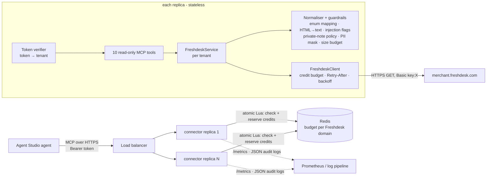

# Architecture

## Request path

One tool call, step by step:

1. **Auth** (HTTP mode): `RegistryTokenVerifier` hashes the bearer token and looks it up with constant-time comparison. The **tenant comes from the token**, never from tool arguments, so a prompt-injected agent cannot read another merchant's data.
2. **`_call` wrapper** (`mcp_server.py`): resolves the tenant's `FreshdeskService` (cached), and starts metering: latency, Freshdesk credits, upstream requests, guardrail events.
3. **Service** (`service.py`): validates arguments and builds safe Freshdesk queries (`query.py`; the model never writes query syntax). It loads the account's custom ticket statuses from `/ticket_fields` once.
4. **Client** (`client.py`): `acquire(cost)` against the rate budget. The cost is predicted from `include` and corrected from `X-RateLimit-Used-CurrentRequest`. If the wait would exceed `FRESHDESK_MAX_WAIT_S`, the call fails fast with `rate_limited` and `retry_after_seconds`. On a 429 it honours `Retry-After`; on 5xx or network errors it backs off with jitter. All calls are GETs, so retries are safe.
5. **Normaliser and guardrails** (`normalize.py`, `guardrails.py`): turn numeric codes into words, convert HTML to text, truncate long bodies, withhold private notes (default), flag injection attempts, mask PII (per tenant), and apply the response size budget.
6. **Result or error.** Every error is JSON with `error`, `message` and `hint`. Unexpected exceptions become `internal_error`; details go to the logs only.
7. **Audit and metrics.** Each call writes one JSON audit line (arguments PII-masked) and updates Prometheus counters and histograms.

## Modules

| Module | Responsibility |
|---|---|
| `auth.py` | API-key credentials, `0600` local store, domain validation (SSRF hygiene) |
| `tenancy.py` | Tenant registry (no secrets inside), hashed bearer tokens, MCP `TokenVerifier` |
| `ratelimit.py` | Credit budgets: in-memory and Redis (atomic Lua, Redis server time) |
| `client.py` | HTTP, retries, error mapping, per-call credit accounting |
| `query.py` | Typed filters → Freshdesk search language (allow-listed characters, 512-char cap) |
| `service.py` | list/get/search primitives, status catalogue, composite `customer_ticket_history` |
| `normalize.py` | LLM-shaped records, private-note policy, PII masking |
| `guardrails.py` | Prompt-injection detector, response size budget, guardrail event tracking |
| `observability.py` | JSON logs, audit trail, Prometheus registry |
| `mcp_server.py` | Tool definitions, `_call` wrapper, server factory, `/healthz` `/readyz` `/metrics` |
| `cli.py` | `auth login/status/logout`, `token create`, `serve`, `export-spec` |

## Deployment shapes

| | stdio | Hosted HTTP |
|---|---|---|
| Merchants | 1 (env vars or `auth login`) | many (tenant registry) |
| Auth | process boundary | bearer token → tenant (SHA-256 hashed at rest) |
| State | in-process | none in the replica; budget in Redis |
| Scaling | n/a | horizontal (stateless streamable HTTP, JSON responses) |
| Use | local agents, demo, CI | Agent Studio production |

## Design decisions and trade-offs

- **Read-only v1.** Most merchant support questions are lookups. Write tools ("add note", "set status") are the next step, behind human approval and with their own scopes. They are not exposed to a model on day one.
- **Budget in credits, per Freshdesk domain.** Freshdesk charges `include`s extra and limits per account. Keying the budget by domain means two tenants pointing at the same helpdesk share one budget.
- **Fail fast rather than queue.** A chat user waiting 60 seconds is worse than an honest "temporarily unavailable". `max_wait` bounds how long any call can hang.
- **Deterministic guardrails rather than an LLM classifier.** Regex flags are cheap, explainable and testable for false positives. They *flag* rather than *block*, because the merchant still needs to see a suspicious ticket. A model-based classifier can be added later behind the same `content_flags` contract.
- **The tenant comes from the token.** Moving the tenant into tool arguments would turn every prompt injection into a cross-merchant data leak.
